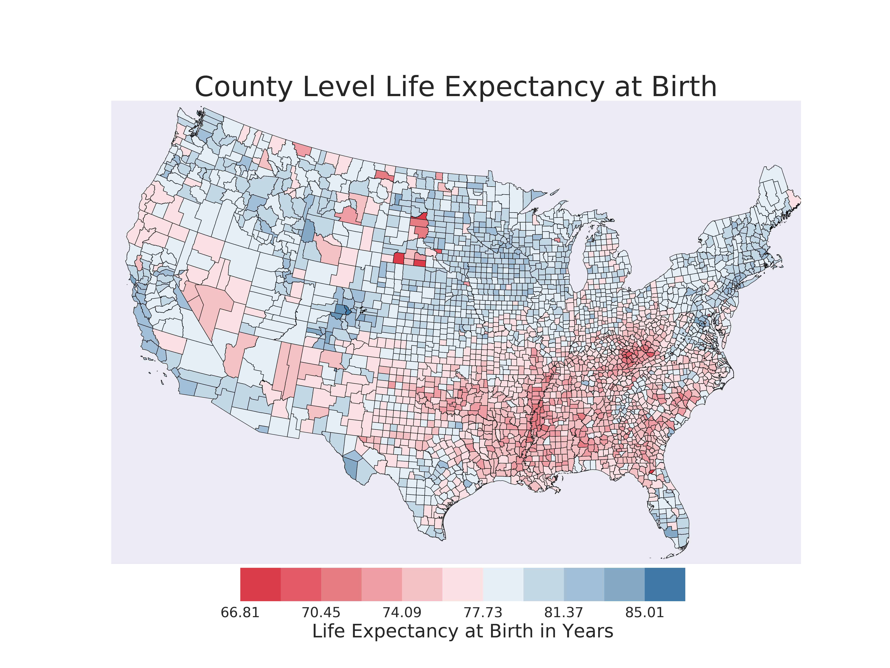

# Mapping Life Expectancy and Racial Covariates
Working with technology to map county level health expectancy and census data. The work was inspired by a paper [Inequalities in Life Expectancy Among US Counties, 1980 to 2014](https://jamanetwork.com/journals/jamainternalmedicine/fullarticle/2626194) where my life expectancy data comes from. For a quick summary of the paper please visit [this blog](https://directorsblog.nih.gov/2017/05/16/widening-gap-in-u-s-life-expectancy/#more-8345)

Life expectancy data can be found [here](http://ghdx.healthdata.org/record/united-states-life-expectancy-and-age-specific-mortality-risk-county-1980-2014) under the 'Files' tab, with a visualization tool [here](https://vizhub.healthdata.org/subnational/usa). 

Census data can be found on the [US Census site](https://www.census.gov/data/datasets/2016/demo/popest/counties-detail.html)

So far the map looks like this:

