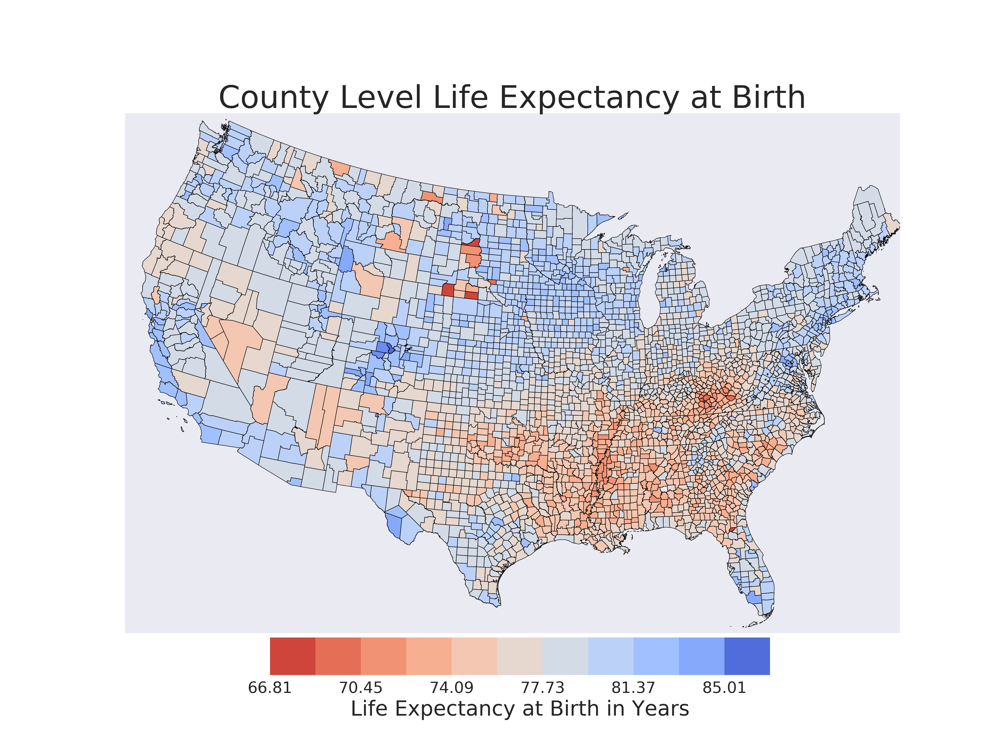
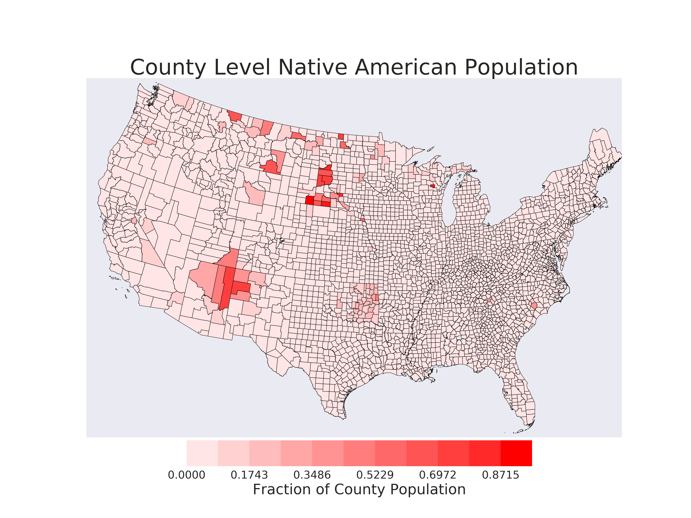

# Mapping Life Expectancy and Racial Covariates
Working with technology to map county level health expectancy and census data. The work was inspired by the paper [Inequalities in Life Expectancy Among US Counties, 1980 to 2014](https://jamanetwork.com/journals/jamainternalmedicine/fullarticle/2626194) where the life expectancy data comes from. For a quick summary of the paper please visit [this blog](https://directorsblog.nih.gov/2017/05/16/widening-gap-in-u-s-life-expectancy/#more-8345)

Life expectancy data can be found [here](http://ghdx.healthdata.org/record/united-states-life-expectancy-and-age-specific-mortality-risk-county-1980-2014) under the 'Files' tab, with a visualization tool [here](https://vizhub.healthdata.org/subnational/usa). 

Census data can be found on the [US Census site](https://www.census.gov/data/datasets/2016/demo/popest/counties-detail.html)

So far the LE map looks like this:

So far the Native American Population map looks like this:

The reason I started this work is because when I saw the first map I recognized that areas with low life expectancy were near Native American reservations. After having plotted both maps it's apparent that geographical areas with large native populations have lower life expectancies, which isn't surprising given the living conditions. The paper where I got the data from confirms this with a much more robust analysis. I'm working on a way to overlay the two maps, or combine the census and life expectancy data. There's still a lot to be done with this visualization.
